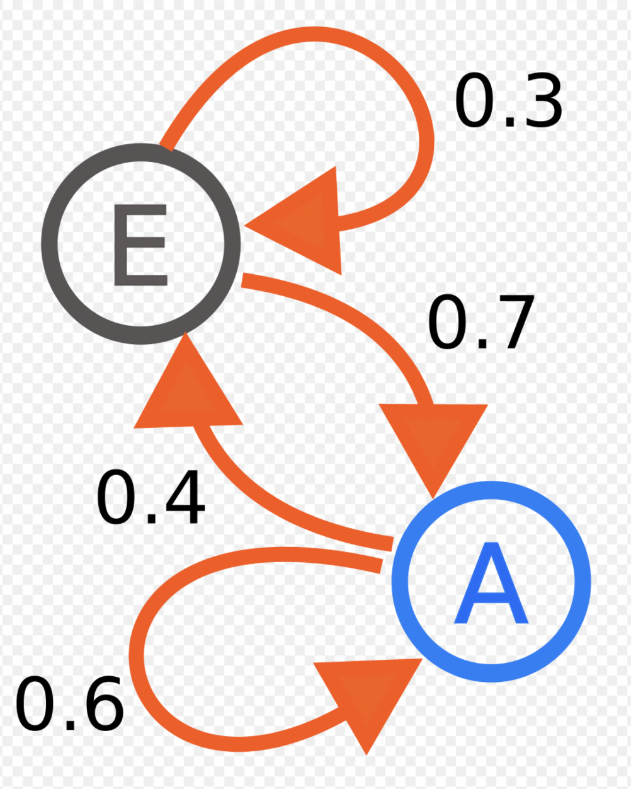

<h1 align="center"> Elon Markov Chain Twitter Bot :bird: </h1> 
<h2 align="center"> What is it? </h2>


<br>
<p align="center"> 
  Upon running of the lambda function (markov_tweet.py), all Elon Musks Tweets are scraped, cleaned and concatenated with a large dataset of childrens books. 
  
  From here, a first order Markov Chain is generated, and words are recursively generated from this Markov Chain until either the Twitter word limit or a sentence conclusion is reached.
</p>
<br>
<h2 align="center"> Markov What?! </h2>


<p align="center"> 
  A Markov Chain is a stochastic model that describes a sequence of events. We call an event the transitioning of a state. Events must satisfy the **Markov Property** - meaning that the probability of the next state transition depends only on current or previous states. In Figure 1, our states are the nodes A & E. Events are given by the orange edges - with state transition probabilities in black.
  
  ```math
  e^{x-1}
  ```
</p>
