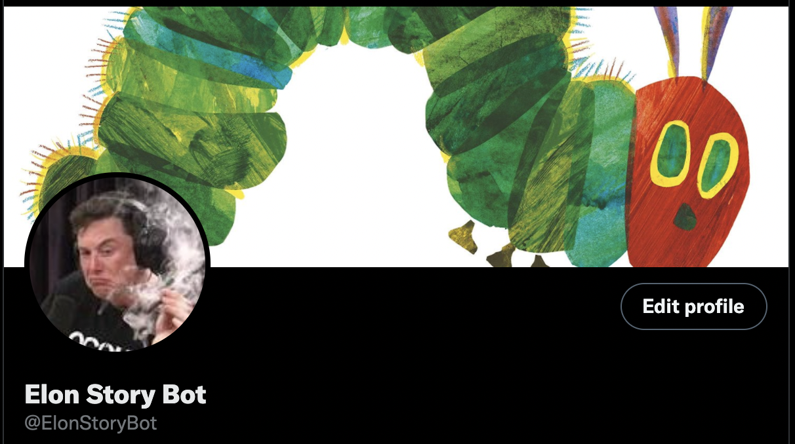

<h1 align="center"> Elon Markov Chain Twitter Bot </h1> 

<h2 align="center"> What is it? </h2>

 
  Upon running of the lambda function (markov_tweet.py), all Elon Musks Tweets are scraped, cleaned and concatenated with a large dataset of childrens books. 
  
  From here, a first order Markov Chain is generated, and words are recursively generated from this Markov Chain until either the Twitter word limit or a sentence conclusion is reached.

 
<h2 align="center"> Markov What?! </h2>
